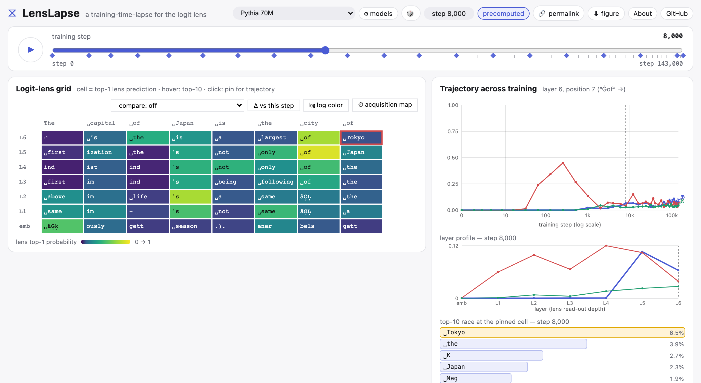

# LensLapse ⧖

**A fully in-browser time-lapse for the logit lens: scrub across Pythia's public training checkpoints and watch next-token predictions crystallize from noise into knowledge — layer by layer, with zero backend.**



- **Live demo:** https://iamtatsuki05.github.io/lenslapse/ (works in any modern browser; WebGPU used when available, WASM otherwise)
- **Project page:** https://iamtatsuki05.github.io/lenslapse/about/
- **Converted checkpoints (HF):** https://huggingface.co/iamtatsuki05/lenslapse-onnx
- **Demo video:** https://www.youtube.com/watch?v=OBnvG9Ru3j8
- **Documentation:** https://iamtatsuki05.github.io/lenslapse/docs/ (guides + API reference)


## Eleven shipped models, one architecture-generic recipe

| Model | Params | Checkpoints | Languages |
|---|---|---|---|
| Pythia 14M / 70M / 160M | 14M–160M | 20 training steps each | English |
| GPT-2 | 124M | final checkpoint | English |
| MAP-Neo | 250M | 8 training steps (Hub subfolders) | Chinese/English |
| BAAI Aquila | 135M | 6 training steps (Hub subfolders) | Chinese/English |
| BLOOM | 560M | 8 training steps (`global_step{N}` revisions) | Multilingual (46 languages) |
| SmolLM2 | 135M | final checkpoint | English |
| Qwen3 | 0.6B | final checkpoint | Multilingual |
| OPT | 125M | final checkpoint | English |
| Gemma 3 | 270M | final checkpoint | Multilingual |

Switchable in the header, each labeled by its documented language support ("Multilingual", "Chinese/English", or untagged for English-only) and offering only the curated prompts it can actually handle. The recipe itself is architecture-generic (GPT-NeoX, GPT-2, Llama-style RMSNorm, Mistral-style RMSNorm, and Gemma-style plus-one-weight RMSNorm models all pass the parity check — see `src/lenslapse/check_arch_parity.py`); a layout the generic heuristic can't reach registers an explicit override in one line via `register_architecture()` (`src/lenslapse/arch.py`), without touching the resolver itself. `opt-125m` and `gemma3-270m` carry non-Apache-2.0/MIT licenses — see `docs/model-card.md` before redistributing or deploying them.

## Highlights

- **One-click figure export**: the current view (grid + trajectory + metadata) downloads as a publication-ready PNG (3× pixel density) or PDF.
- Curated prompts are **instant**: logit-lens grids across training checkpoints are precomputed (fp32) and served as static JSON.
- Free-text prompts run **live**, in your browser or on a connected probe server: one click probes every checkpoint automatically (not just the current one), so the same ▶ playback that animates curated prompts works for anything you type, and comparing two models falls back to a live probe when one of them has no precomputed match for the prompt — your prompt never leaves your device unless a probe server is connected. MAP-Neo and Aquila's tokenizers rely on custom Python code with no browser-compatible fast-tokenizer equivalent, so free-text live probing those two specifically needs a connected probe server; their curated prompts are unaffected.

## Quick start: probe your own models (no checkout needed)

```bash
pip install lenslapse
lenslapse server        # serves the web app AND the probe API on one local port, then opens it
```

Everything runs on `http://localhost:8017/` — the UI is bundled into the package, so this works
fully offline once models are downloaded, with no CORS or browser permission prompts.
Click **⚙ models** in the header, pick a Hugging Face id or press **📁 Browse…** to choose a
checkpoint folder with your OS's file dialog, and probe it live — no ONNX conversion, no config
files. (In a checkout, `uv run lenslapse server` serves your own `web/dist` build instead;
run `scripts/bundle_webapp.sh` after changing `web/` to refresh the packaged shell.)

## Why

- No public, hosted tool lets you interactively inspect a real LLM's internals *across training time* (Pythia ships 154 checkpoints, but existing views are loss curves and static galleries).
- No logit-lens tool of any kind runs fully client-side; hosted server-side demos rot when their backends die.
- LensLapse makes training time a first-class axis of token-level interpretability, and its zero-backend design means unlimited concurrent users at zero hosting cost — the demo cannot rot.

## Architecture

```
Pythia checkpoint (HF Hub, revision step{N})
   └─ src/lenslapse/export_checkpoints.py
        ├─ backbone.f16.onnx   input_ids → hidden states [L+1, T, H]   (pre-ln, uniform; via forward hooks)
        └─ lens.f16.onnx       hidden [N, H] → logits [N, V]           (final_layer_norm + unembedding)
   └─ src/lenslapse/precompute_lens.py → static JSON shards (top-10 per cell + exact target trajectories)

web/ (Vite, TypeScript)
   ├─ precomputed mode: fetch JSON shard → canvas grid + SVG trajectories (no model download)
   └─ live mode: onnxruntime-web (WebGPU→WASM fallback) + @huggingface/transformers tokenizer
```

Key property: `lens(hidden[-1]) == model logits` **exactly** (validated per checkpoint at export). Weights are stored fp16 and cast to fp32 at session load; dynamic int8 was rejected because its final-layer top-1 agreement with fp32 drops to 52% (per-tensor; 71% per-channel) at late checkpoints (see `src/lenslapse/fidelity_eval.py`).

## Advanced usage

See [`docs/advanced-usage.md`](docs/advanced-usage.md) for: local development setup, converting
checkpoints & precomputing lens data, adding your own model (Hub or local), running the local
probe server for heavy models, scripting every feature from the CLI, probe reproducibility, and
benchmarking. The same guides plus a full API reference are rendered at
https://iamtatsuki05.github.io/lenslapse/docs/.

## Deploy (zero cost)

1. Upload the converted models to a public Hugging Face model repo and set `HF_DEFAULT` in `web/src/live.ts`.
2. `npm run build`, publish `web/dist/` to GitHub Pages (workflow in `.github/workflows/deploy-pages.yml`).
3. There is no step 3 — no server, no keys, no bills. See `docs/deployment.md`.

## License

MIT. Pythia checkpoints are © EleutherAI, Apache-2.0; GPT-2 weights are © OpenAI, MIT (Modified);
MAP-Neo and BAAI Aquila checkpoints are Apache-2.0. **BLOOM checkpoints are © BigScience Workshop,
licensed under the BigScience RAIL License v1.0** — not a plain permissive license like the others
here; it attaches use-based behavioral restrictions to downstream recipients. **`opt-125m` (Meta's
OPT-175B License Agreement) is non-commercial-research-only — no commercial use is permitted at
all.** **`gemma3-270m` (Google's Gemma Terms of Use) permits commercial use but requires passing its
Prohibited Use Policy on to downstream recipients and remains subject to Google's unilateral right
to restrict or terminate use.** See `docs/model-card.md` for the full attribution and license text
for every model.
